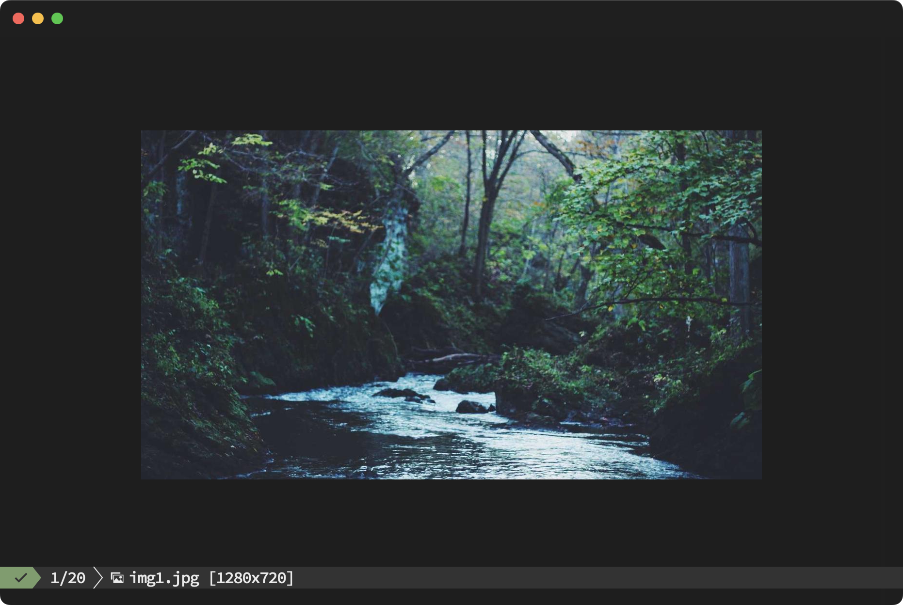
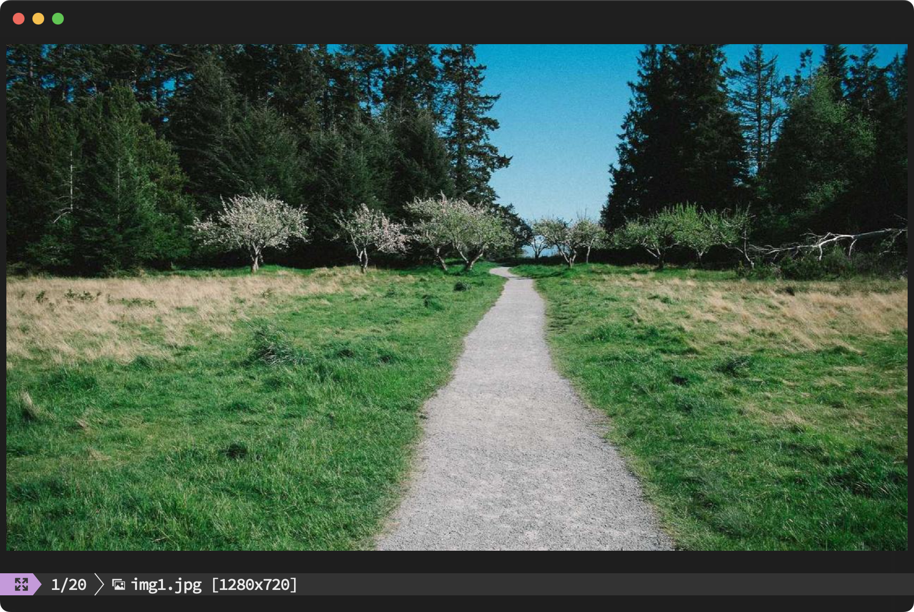
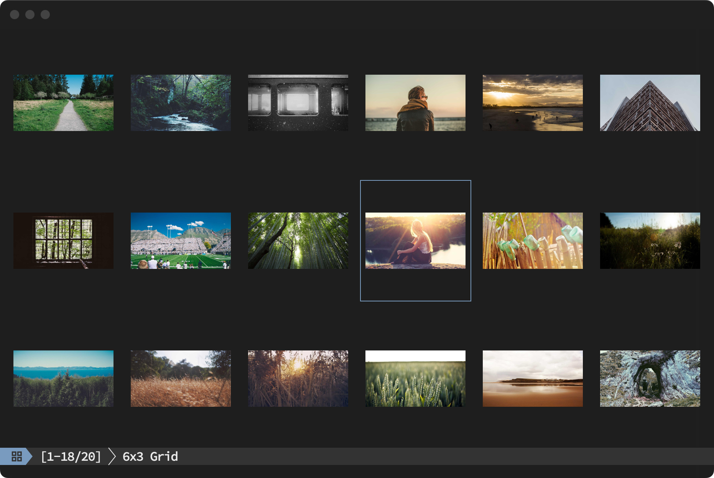

<div align="center">

# ✨ **SVT** - **S**imple image **V**iewer in **T**erminal ✨

*A minimal & fast terminal image viewer written in Rust with sxiv-like keybindings*

[](https://github.com/kan-bayashi/svt/actions/workflows/ci.yml)
[](https://opensource.org/licenses/MIT)
[](https://www.rust-lang.org/)
[](https://github.com/kan-bayashi/svt)
[](https://github.com/kan-bayashi/svt/releases)

[Features](#-features) • [Requirements](#-requirements) • [Installation](#-installation) • [Usage](#-usage) • [Keybindings](#️-keybindings) • [Configuration](#️-configuration)

</div>

## 📽️ Demo


## 🚀 Features

| Feature | Description |
|---------|-------------|
| ⚡ **Fast** | Zlib compression, prefetch, and render cache for instant navigation |
| ⌨️ **Keyboard-driven** | sxiv/vim-like keybindings with count support |
| 📋 **Clipboard** | Copy path (OSC 52, works over SSH) or image to clipboard (local/X11 only) |
| 🔄 **Flexible** | Fit/Normal display modes, works over SSH with Tmux |
| 🖼️ **KGP** | Kitty Graphics Protocol for high-quality image rendering |
| 🗂️ **Tile Mode** | Grid view with thumbnail navigation |


## 🖼️ View Modes

<table>
<tr>
<td align="center"><b>Normal Mode</b><br><sub>Original size (shrink-only)</sub></td>
<td align="center"><b>Fit Mode</b><br><sub>Scale to fill viewport</sub></td>
<td align="center"><b>Tile Mode</b><br><sub>Grid thumbnail view</sub></td>
</tr>
<tr>
<td></td>
<td></td>
<td></td>
</tr>
</table>

## 📋 Requirements

### 🖥️ Supported Terminals

| Terminal | Status |
|----------|--------|
| [Ghostty](https://ghostty.org/) | ✅ Recommended |
| [Kitty](https://sw.kovidgoyal.net/kitty/) | ✅ Supported |
| [WezTerm](https://wezfurlong.org/wezterm/) | ✅ Supported |
| Other KGP terminals | ✅ Supported |

> 💡 **tmux:** Works with tmux. Passthrough is enabled automatically.

> 🔧 **Building from source:** Rust 1.75+ required.

## 📦 Installation

### 📥 From Release

Download the latest binary from [Releases](https://github.com/kan-bayashi/svt/releases):

<details>
<summary>🍎 macOS (Apple Silicon)</summary>

```bash
curl -L https://github.com/kan-bayashi/svt/releases/latest/download/svt-aarch64-apple-darwin.tar.gz | tar xz
sudo mv svt /usr/local/bin/
```

</details>

<details>
<summary>🐧 Linux (x86_64)</summary>

```bash
curl -L https://github.com/kan-bayashi/svt/releases/latest/download/svt-x86_64-unknown-linux-gnu.tar.gz | tar xz
sudo mv svt /usr/local/bin/
```

</details>

### 🔨 From Source

```bash
cargo install --path .
```

## 🎯 Usage

```bash
svt image.png           # Single image
svt ~/photos/           # Directory
svt *.png               # Glob pattern
svt ~/photos/*.jpg      # Combined
```

## ⌨️ Keybindings

| Key | Action | Description |
|:---:|--------|-------------|
| `j` / `Space` / `l` | ➡️ Next | Next image / move cursor down-right |
| `k` / `Backspace` / `h` | ⬅️ Previous | Previous image / move cursor up-left |
| `g` | ⏮️ First | Jump to first image |
| `G` | ⏭️ Last | Jump to last image |
| `f` | 🔄 Toggle | Toggle fit mode |
| `t` | 🗂️ Tile | Toggle tile/single view |
| `Enter` | ✅ Select | Select tile (Tile mode) |
| `H`/`J`/`K`/`L` | 📄 Page | Page navigation (Tile mode) |
| `r` | 🔃 Reload | Reload and clear cache |
| `y` | 📋 Copy Path | Copy path to clipboard (OSC 52) |
| `Y` | 🖼️ Copy Image | Copy image to clipboard (Local or X11) |
| `q` | 🚪 Quit | Exit the viewer |

> 💡 **Pro tip:** Vim-like counts are supported (e.g. `5j`, `10G`)

## ⚙️ Configuration

Settings can be configured via config file or environment variables.

```
📌 Priority: Environment variables > Config file > Defaults
```

### 📝 Config File

Create `~/.config/svt/config.toml`:

```toml
nav_latch_ms = 150
render_cache_size = 100
prefetch_count = 5
prefetch_threads = 2
compress_level = 6
cell_aspect_ratio = 2.0
resize_filter = "triangle"
tile_filter = "nearest"
tile_threads = 4
```

### 📊 Options

| Config Key | Env | Default | Description |
|------------|-----|:-------:|-------------|
| `nav_latch_ms` | `SVT_NAV_LATCH_MS` | `150` | Navigation latch (ms) |
| `render_cache_size` | `SVT_RENDER_CACHE_SIZE` | `100` | Render cache entries |
| `prefetch_count` | `SVT_PREFETCH_COUNT` | `5` | Prefetch count |
| `prefetch_threads` | `SVT_PREFETCH_THREADS` | `2` | Prefetch thread count (1-8) |
| `compress_level` | `SVT_COMPRESS_LEVEL` | `6` | Zlib compression (0-9) |
| `kgp_no_compress` | `SVT_KGP_NO_COMPRESS` | `false` | Disable compression |
| `tmux_kitty_max_pixels` | `SVT_TMUX_KITTY_MAX_PIXELS` | `1500000` | Max pixels (tmux+kitty) |
| `force_alt_screen` | `SVT_FORCE_ALT_SCREEN` | `false` | Force alt screen |
| `no_alt_screen` | `SVT_NO_ALT_SCREEN` | `false` | Disable alt screen |
| `debug` | `SVT_DEBUG` | `false` | Debug mode |
| `trace_worker` | `SVT_TRACE_WORKER` | `false` | Worker tracing |
| `cell_aspect_ratio` | `SVT_CELL_ASPECT_RATIO` | `2.0` | Cell aspect ratio (tile grid) |
| `resize_filter` | `SVT_RESIZE_FILTER` | `triangle` | Resize filter for single mode (nearest, triangle, lanczos3) |
| `tile_filter` | `SVT_TILE_FILTER` | `nearest` | Resize filter for tile mode (fastest for thumbnails) |
| `tile_threads` | `SVT_TILE_THREADS` | `4` | Tile processing thread count (1-8) |

## 🤝 Contributing

Contributions are welcome! See `CONTRIBUTING.md` for guidelines.

## 📚 References

- 🦀 [yazi](https://github.com/sxyazi/yazi) - Kitty Graphics Protocol implementation reference
- 📖 [Kitty Graphics Protocol](https://sw.kovidgoyal.net/kitty/graphics-protocol/)

## 📄 License

```
MIT License - Feel free to use, modify, and distribute! 🎉
```

