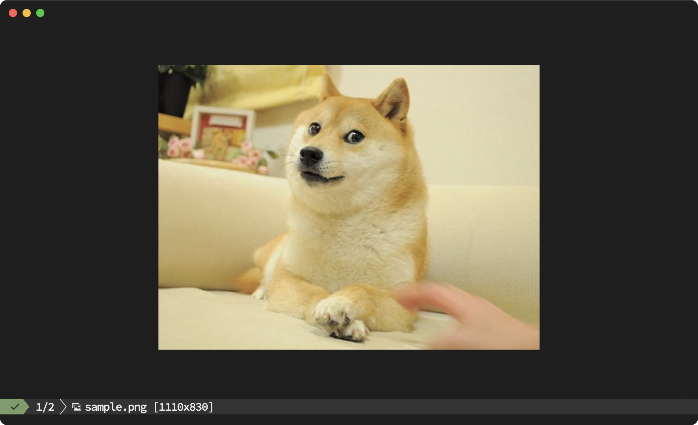

# sivit

**S**imple **I**mage **V**iewer **I**n **T**erminal

A terminal-based image viewer with sxiv-like keybindings. Works over SSH.



## Features

- Kitty Graphics Protocol (KGP) image rendering
- sxiv/vim-like keyboard navigation (counts supported)
- Render cache for snappy navigation
- `Fit` toggle (upscale to viewport) + `Normal` (shrink-only)

## Requirements

- Kitty Graphics Protocol supported terminal
- Optional: tmux (uses `allow-passthrough=on`, `sivit` attempts to set it automatically)
- Rust 1.75+

Tested: Ghostty + tmux.

## Installation

```bash
cargo install --path .
```

## Usage

```bash
sivit image.png
sivit ~/photos/
sivit *.png
sivit ~/photos/*.jpg
```

## Keybindings

| Key | Action |
|-----|--------|
| `j` / `Space` / `l` | Next image |
| `k` / `Backspace` / `h` | Previous image |
| `g` | First image |
| `G` | Last image |
| `f` | Toggle fit |
| `r` | Reload (clear cache) |
| `q` | Quit |

Vim-like counts are supported (e.g. `5j`, `10G`).

## Options

| Env | Default | Description |
|-----|---------|-------------|
| `SIVIT_NAV_LATCH_MS` | `150` | Navigation latch (ms) before drawing images; helps rapid key taps feel snappy |
| `SIVIT_RENDER_CACHE_SIZE` | `15` | Render cache entries (can be memory-heavy) |
| `SIVIT_TMUX_KITTY_MAX_PIXELS` | `1500000` | Max pixels in `Normal` mode (tmux+kitty compatibility); ignored in `Fit` mode |
| `SIVIT_FORCE_ALT_SCREEN` | unset | Force alternate screen |
| `SIVIT_NO_ALT_SCREEN` | unset | Disable alternate screen |

## Contributing

See `CONTRIBUTING.md`.

## References

- [yazi](https://github.com/sxyazi/yazi) - Kitty Graphics Protocol implementation reference
- [Kitty Graphics Protocol](https://sw.kovidgoyal.net/kitty/graphics-protocol/)

## License

MIT
